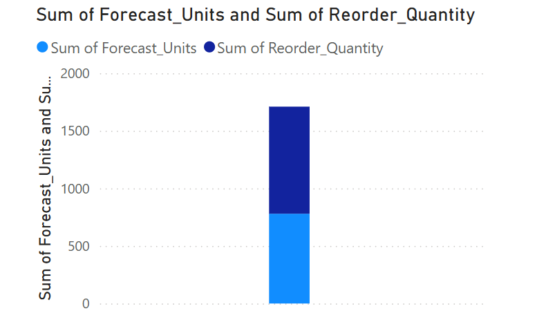

# 📦 Inventory Forecasting & Reorder Dashboard

This project forecasts product sales and generates reorder quantities using ARIMA, helping streamline inventory planning.  
Built with **Python**, **Streamlit**, and **Plotly**.

---

## 🔍 Project Overview

- **Input**: Sales data of products across stores  
- **Model**: ARIMA time series forecasting  
- **Output**: 30-day sales forecast and reorder plan with safety stock  
- **Visualization**: Interactive dashboard using Streamlit

---

## 📈 Dashboard Preview



---

## 📊 Forecasting Logic

- **Forecasting Model**: ARIMA (2,1,2)
- **Forecast Horizon**: 30 days
- **Reorder Quantity**: `Forecasted_Units × 1.2` (20% safety buffer)

---

## 🚀 How to Run the App

### 1. Clone the repository

```bash
git clone https://github.com/yourusername/your-repo-name.git
cd your-repo-name
